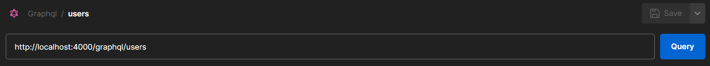
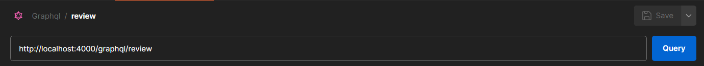
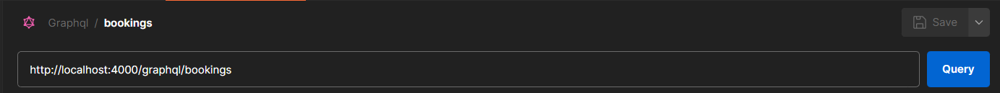
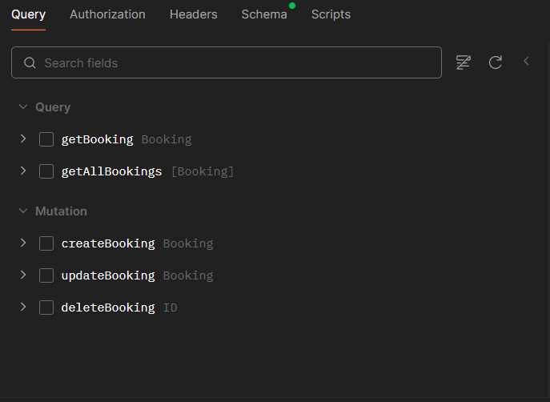

Please note that the Graphql collection is not shareable as it is still in beta stage in Postman
But if you just open postman, make a new collection which supports Graphql, make a new qraphql request and enter this
 or
 or

it will automatically generate the queries and mutations. And just clicks will do the work. 
This is a how it would look like 